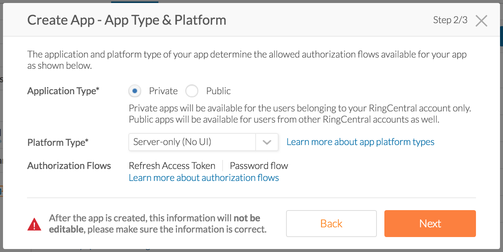
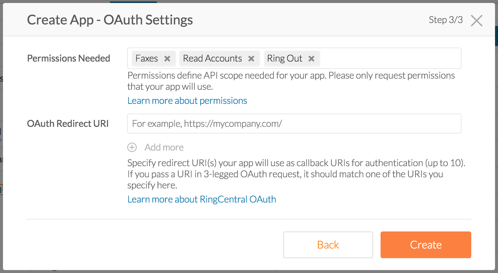

RingCentral Legacy API Proxy
============================

[![Build Status][build-status-svg]][build-status-link]
[![Go Report Card][goreport-svg]][goreport-link]
[![Docs][docs-godoc-svg]][docs-godoc-link]
[![License][license-svg]][license-link]
[![Stack Overflow][stackoverflow-svg]][stackoverflow-url]
[![Chat][chat-svg]][chat-url]

 [build-status-svg]: https://api.travis-ci.org/grokify/ringcentral-legacy-api-proxy.svg?branch=master
 [build-status-link]: https://travis-ci.org/grokify/ringcentral-legacy-api-proxy
 [goreport-svg]: https://goreportcard.com/badge/github.com/grokify/ringcentral-legacy-api-proxy
 [goreport-link]: https://goreportcard.com/report/github.com/grokify/ringcentral-legacy-api-proxy
 [docs-godoc-svg]: https://img.shields.io/badge/docs-godoc-blue.svg
 [docs-godoc-link]: https://godoc.org/github.com/grokify/ringcentral-legacy-api-proxy
 [license-svg]: https://img.shields.io/badge/license-MIT-blue.svg
 [license-link]: https://github.com/grokify/ringcentral-legacy-api-proxy/blob/master/LICENSE
 [chat-svg]: https://img.shields.io/badge/chat-on%20glip-orange.svg
 [chat-url]: https://glipped.herokuapp.com/
 [stackoverflow-svg]: https://img.shields.io/badge/stack%20overflow-ringcentral-orange.svg
 [stackoverflow-url]: https://stackoverflow.com/questions/tagged/ringcentral

This is a proxy service that allows apps using RingCentral's legacy RPC APIs to use the new [RingCentral REST APIs](https://developer.ringcentral.com) seamlessly. End-of-Life for the legacy APIs is targeted for the 10.2 release, August 9, 2018. Use of this proxy can enable your app to use the new REST APIs with the same interface as the legacy RPC APIs.

* https://service.ringcentral.com/ringoutapi/ ([docs](https://grokify.github.io/ringcentral-legacy-api-proxy/ringoutapi.html))
* https://service.ringcentral.com/faxoutapi/ ([docs](https://grokify.github.io/ringcentral-legacy-api-proxy/faxoutapi.html))

The following is a list of legacy API calls. The ones with checks are currently supported:

* [x] [RingOut `call` command](https://grokify.github.io/ringcentral-legacy-api-proxy/ringoutapi.html#call)
* [x] [RingOut `list` command](https://grokify.github.io/ringcentral-legacy-api-proxy/ringoutapi.html#list)
* [ ] [RingOut `status` command](https://grokify.github.io/ringcentral-legacy-api-proxy/ringoutapi.html#status)
* [ ] [RingOut `cancel` command](https://grokify.github.io/ringcentral-legacy-api-proxy/ringoutapi.html#cancel)
* [x] [FaxOut](https://grokify.github.io/ringcentral-legacy-api-proxy/faxoutapi.html)

Note: a new query string parameter is provided, `format=json`, which instructs the service to return the REST API JSON response. If this is not provided, the response is converted to a legacy API response.

## Prerequisites

Create a RingCentral app at the developer portal: [https://developer.ringcentral.com](https://developer.ringcentral.com). Access is included with many RingCentral accoutns so just click 'Sign in' to continue.

Create an app with the following setting.

`App Type`: `Server-only (No UI)`

Ensure that `Password grant` is set.



Select the permissions you need. There are a total of three permissions for all legacy APIs, but you should just select the ones you need as you will need to exercise all the permissions to graduate your app.

| Permission | Required for |
|------------|--------------|
| `RingOut` | RingOut `call`, `status`, `cancel` |
| `ReadAccounts` | RingOut `list` |
| `Faxes` | FaxOut |



## Configuration

This application needs the following configuration variables:

| Variable | Required | Description |
|----------|----------|-------------|
| `RINGCENTRAL_CLIENT_ID` | yes | Your application's Client ID |
| `RINGCENTRAL_CLIENT_SECRET` | yes | Your application's Client Secret |
| `RINGCENTRAL_SERVER_URL` | yes | Your RingCentral server url, e.g. Sandbox: https://platform.devtest.ringcentral.com , Production: https://platform.ringcentral.com |

## Installation

### Deploying to Heroku

```sh
$ heroku create
$ git push heroku master
$ heroku open
```

or

[](https://heroku.com/deploy)

After you click the button above, you will need to enter the environment variables above into the Heroku web console.

Once this is up, you can make API calls by swapping `service.ringcentral.com` for your Heroku hostname, e.g. `myherokuapp.herokuapp.com` as follows:

`https://<myHerokuApp>.herokuapp.com/ringout.asp?cmd=call&username=<myUsername>&password=<myPassword>&to=<myToNumber>&from=<myFromNumber>`

Note: the [`app.json`](https://github.com/grokify/ringcentral-legacy-api-proxy/blob/master/app.json#L17) specifies a free dyno which will sleep due to inactivity. If you wish to use Heroku dyno that does not sleeps, clone this repo and update your `app.json`. Learn more about Heroku Dyno types here:

* https://devcenter.heroku.com/articles/dyno-types

### Running Locally

```
$ go get github.com/grokify/ringcentral-legacy-api-proxy
$ cd ringcentral-legacy-api-proxy
$ go build main.go
$ RINGCENTRAL_SERVER_URL=https://platform.devtest.ringcentral.com \
  RINGCENTRAL_CLIENT_ID=<myClientId> \
  RINGCENTRAL_CLIENT_SECRET=<myClientSecret> \
  main
```

## Example API Calls

### RingOut `call`

`$ curl -XGET 'http://localhost:8080/ringout.asp?Username=<myUsername>&Password=<myPassword>&Cmd=call&to=<toNumber>&from=<fromNumver>&Format=json'`

### RingOut `list`

`$ curl -XGET 'http://localhost:8080/ringout.asp?Username=<myUsername>&Password=<myPassword>&Cmd=list&Format=json'`

### FaxOut

```
$ curl -XPOST 'http://localhost:8080/faxout.asp' \
  -F 'Username=<myUsername>' \
  -F 'Password=<myPassword>' \
  -F 'Recipient=<recipient>' \
  -F 'Coverpagetext=<coverPageText>' \
  -F 'Resolution=High' \
  -F 'Attachment=@test_file.pdf' \
  -F 'Format=json'
```

## Notes

### Troubleshooting

The REST API has throttling built in so you should check for 429 throttling errors.

### Maintenance

Rebuild `vendor` directory with:

```
$ godep save ./...
```

More information on deploying Go on Heroku here:

* https://devcenter.heroku.com/articles/go-support